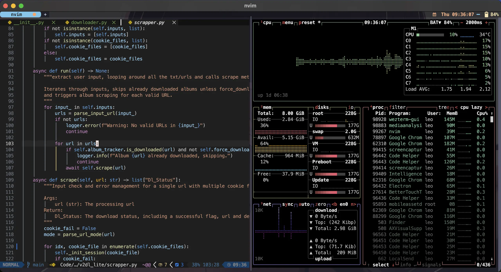
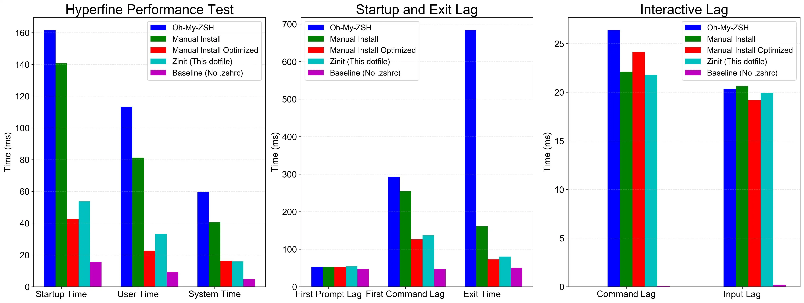

<h1 align="center">My Zsh Dotfile Built for Speed!</h1>

</br>

<p align="center">
  
</p>

## How Fast Is It

使用專門測試 shell 的 [zsh-bench](https://github.com/romkatv/zsh-bench/) 和直觀易懂的 hyperfine 進行測試[^test-method]，測試項目涵蓋五種框架：

- Oh-My-ZSH: 最多人使用的框架並且加上 zsh-defer 優化
- Zinit: 講求效能的插件管理器
- No Plugin Manager: 不使用插件管理器以減少延遲，並且使用 zsh-defer 優化
- Zim: 標榜 [blazing speed](https://github.com/zimfw/zimfw/wiki/Speed) 的插件管理器
- zcomet: 此份 dotfile
- Baseline: 基準線，移除 .zshrc，本機能達到的最快速度

測試項目的選擇從最廣泛使用的框架到手動優化，以便準確定位效能，可以看到比 Zinit 更快，基本上追平甚至超越不使用插件管理器的速度，同時又比 Zim 易於設定。

<p align="center">
  
</p>

[^test-method]: 測試執行於 M1 MacBook Pro 8G RAM，zsh-bench 使用預設值，測試總共載入的插件有 powerlevel10k, zsh-defer, zsh-syntax-highlighting, zsh-autosuggestions, zsh-completions, zsh-z, zsh-history-substring-search, extract, git，每個測試都確保 brew/docker/docker-compose/yarn/npm 的指令補全必須正常運作。hyperfine 使用 `hyperfine --runs 100 --warmup 3 'zsh -i -c exit 0'` 測試，請注意 hyperfine 測試是超級簡化的測試[沒有特別意義](https://github.com/romkatv/zsh-bench?tab=readme-ov-file#how-not-to-benchmark)，他只告訴你執行這行指令的平均時間，不代表真正的體感時間。

## 特色

不只是快而且功能齊全，所有設定都基於簡單原則完成，外觀設定模仿 vscode 預設主題，一律使用 nerd font (MesloLGS NF) 字體。

- 🚀 快速啟動：使用 zsh-defer 延遲加載實現 0.04s 的 prompt 載入延遲， 0.1s 的首次指令延遲
- 📂 集中管理：不需要把安裝腳本和設定檔分開管理，一次完成安裝和設定
- 📚 完整註解：保證你看得懂 zshrc 在寫什麼以及為何這樣寫
- 🛠️ 易於調整：.zshrc 乾淨簡潔，讓你不會每次修改頭都很痛
- 🔄 簡單更新：執行 `dotfile-update` 就可輕鬆更新所有插件和系統套件
- 🔲 極簡風格：沒有花花綠綠的分散注意力
- 🎨 已配置完成的 Powerlevel10k 主題
- 📦 多個預先配置的插件
  - zsh-syntax-highlighting 語法上色
  - zsh-autosuggestions 指令歷史建議
  - zsh-completions 指令補全
  - colored-man-pages 上色的 man pages
  - extract 自動解壓縮
  - z 快速切換目錄
- 🌐 LANG、LC_ALL 和 Git 都已經設定好繁體中文
- ✅ GPG、homebrew 和 Git 等套件的常見問題都已經解決
- 🎯 正確的設定指令補全
- ⚙️ 完善設定的 gitconfig，大量借鑒 [mathiasbynens](https://github.com/mathiasbynens/dotfiles)
- 🖥️ 現代化終端機
  - 使用現代終端機，分割視窗不再需要 tmux 並且設定好外觀主題和鍵盤映射
  - wezterm: [binwenwu/wezterm-config](https://github.com/binwenwu/wezterm-config/)
  - warp: [warpdotdev/themes](https://github.com/warpdotdev/themes)
- ✏️ 文字編輯
  - neovim: 使用 Lazyvim 設定檔，鍵盤映射 Ctrl+d 為黑洞刪除
  - helix: onedarker 主題，並且整合 ruff lsp
- 🔧 工具
  - gallery-dl: 精心設計的 config.json，只需修改路徑即可使用
  - yt-dlp: 設定檔為最高畫質和音質，開箱即用

## 安裝

```shell
ASK=1 sh -c "$(curl -fsSL https://raw.githubusercontent.com/ZhenShuo2021/dotfiles/main/remote_install.sh) -k -v"
zimfw install
```

首次執行不會完整安裝，因為 GPG 等需要進一步設定，移除 `ASK=1` 會使用預設名稱作為電腦和用戶名，再次執行 `chezmoi -k apply` 可以進行後續部分的安裝。

其他指令為：

- 清除 chezmoi run_once 狀態  
chezmoi state delete-bucket --bucket=scriptState
- 進入設定檔目錄  
chezmoi cd
- 應用設定檔，環境變數可選  
ASK=1 SETPASS=1 chezmoi init --apply

## 最簡安裝

最簡安裝只會修改 shell 設定不會進行任何額外安裝，在第一個問題輸入 T/F 選擇是否啟用。

## 修改

zshrc 相關設定在 `~/.local/share/chezmoi/home/private_dot_config/zsh` 中，由以下組成

1. 00-basic.zsh: 基礎路徑設定，指向 Zsh 設定檔和 chezmoi 裡面的設定檔
2. 01-plugins.zsh: 載入插件
3. 02-preference.zsh: 各種路徑和常數設定
4. 03-system.zsh: 設定 `setopt` 和 `bindkey`
5. 04-completion.zsh: 設定自動補全
6. 99-alias.zsh: 設定別名，可以任意修改
7. 100-p10k.zsh: p10k 設定檔

編輯方式依照你的習慣是直接編輯 chezmoi 文件還是原始文件，前者可以輸入 `chezmoi cd` 後使用 `v $CM_[tab]` 編輯，最後使用 `make apply` 應用到主目錄；輸入 `v $ZZ[tab]` 則是直接編輯主目錄的點文件，最後再使用 `chezmoi add <file>` 加回儲存庫，常修改的 preference 和 alias 有快捷變數。

## Profiling

內建函式可以方便的進行效能分析，有兩種方式：

1. `zsh_prof_zprof` 使用 `zprof` 指令進行分析，提供數字參數以設定顯示行數，數字以外的參數顯示所有結果。
2. `zsh_prof_xtrace` 藉由 `XTRACE` 和 `EPOCHREALTIME` 生成更細節的報告，使用 `zsh_prof_xtrace -h` 查看使用方式。

## 快捷鍵列表

優化直覺性，盡量同步成系統內建用法。

<details>

<summary>終端機</summary>

**Warp**: 同 WezTerm
**WezTerm**:

- `⌘`: SUPER
- `⌘`+`^`: SUPER_REV
- `⌥`: ALT

```lua
if platform.is_mac then
   mod.SUPER = 'SUPER'
   mod.SUPER_REV = 'SUPER|CTRL'
elseif platform.is_win or platform.is_linux then
   mod.SUPER = 'ALT' -- to not conflict with Windows key shortcuts
   mod.SUPER_REV = 'ALT|CTRL'
end
```

- 視窗
  - 垂直分割: `SUPER`+`d`
  - 水平分割: `SUPER`+`D`
  - 切換: `SUPER_REV` + `方向鍵`
- 原本的背景圖片放在 backdrops/archive 裡面，移出來就可以有隨機背景圖片。

</details>

<details>

<summary>Neovim</summary>

這其實是一個速查表，大部分都是預設值。

<table>
  <tr>
    <th>按鍵</th>
    <th>說明</th>
  </tr>
  <tr>
    <td><code>a</code>/<code>s</code></td>
    <td>在光標前/後插入</td>
  </tr>
  <tr>
    <td><code>Ctrl+d</code></td>
    <td>黑洞刪除</td>
  </tr>
  <tr>
    <td><code>Ctrl+o</code></td>
    <td>回到上一個位置 (等同 vscode Ctrl+-)</td>
  </tr>
  <tr>
    <td><code>Home</code></td>
    <td>仿照 vscode 的智慧 Home 鍵</td>
  </tr>
  <tr>
    <td><code>*</code></td>
    <td>下一個文字出現位置</td>
  </tr>
  <tr>
    <td><code>g-d</code></td>
    <td>跳到變數定義位置</td>
  </tr>
  <tr>
    <td><code>Ctrl-f</code></td>
    <td>往下捲動10行</td>
  </tr>
  <tr>
    <td><code>Ctrl-b</code></td>
    <td>往上捲動10行</td>
  </tr>
  <tr>
    <td><code>Ctrl-o</code></td>
    <td>回到前一個位置</td>
  </tr>
  <tr>
    <td><code>Space-e</code></td>
    <td>開啟檔案瀏覽器</td>
  </tr>
  <tr>
    <td><code>Ctrl+H/L</code></td>
    <td>切換檔案瀏覽器聚焦位置</td>
  </tr>
  <tr>
    <td><code>Shift+H/L</code></td>
    <td>切換檔案瀏覽器中開啟的檔案</td>
  </tr>
  <tr>
    <td><code>Space-b-d</code></td>
    <td>光標切換檔案/檔案瀏覽器</td>
  </tr>
  <tr>
    <td><code>h</code></td>
    <td>在檔案瀏覽器中回到上一層</td>
  </tr>
</table>

</details>

<details>

<summary>Git</summary>

大量參考 [mathiasbynens](https://github.com/mathiasbynens/dotfiles)，可使用 `git aliases` 查看 git 系統內的 alias，別名來源有三個：

1. [oh-my-zsh](https://github.com/ohmyzsh/ohmyzsh/tree/master/plugins/git)
2. src/bin/ 裡面的會被綁定到 .gitconfig 裡面作為 alias 使用
3. src/zsh/alias.zsh 是最高層級，會覆蓋所有 alias

<table>
  <tr>
    <th>指令</th>
    <th>全名</th>
    <th>用途簡介</th>
  </tr>
  <tr>
    <td>gc</td>
    <td>git commit</td>
    <td>提交變更</td>
  </tr>
  <tr>
    <td>gc!</td>
    <td>git commit --amend --no-verify</td>
    <td>合併上一提交</td>
  </tr>
  <tr>
    <td>gca</td>
    <td>git commit -a</td>
    <td>提交追蹤檔案</td>
  </tr>
  <tr>
    <td>gco</td>
    <td>git checkout</td>
    <td>切換分支</td>
  </tr>
  <tr>
    <td>gcb</td>
    <td>git copy-branch-name</td>
    <td>複製分支名稱</td>
  </tr>
  <tr>
    <td>gcp</td>
    <td>git cherry-pick</td>
    <td>複製提交</td>
  </tr>
  <tr>
    <td>gtlll</td>
    <td>gtlll(){ git tag --sort=-v:refname -n999 --format="[%(objectname:short) %(refname:short)] %(contents:lines=999)%0a" --list "${1}*" }; noglob gtlll</td>
    <td>尋找指定標籤，無輸入就列出所有，類似指令有 gtll/gtl</td>
  </tr>
  <tr>
    <td>grb</td>
    <td>git rebase</td>
    <td>變基</td>
  </tr>
  <tr>
    <td>grba</td>
    <td>git rebase --abort</td>
    <td>中止變基</td>
  </tr>
  <tr>
    <td>grbc</td>
    <td>git rebase --continue</td>
    <td>繼續變基</td>
  </tr>
  <tr>
    <td>grbi</td>
    <td>git rebase --interactive</td>
    <td>互動式變基</td>
  </tr>
  <tr>
    <td>grbo</td>
    <td>git rebase --onto</td>
    <td>指定基底變基</td>
  </tr>
  <tr>
    <td>grbs</td>
    <td>git rebase --skip</td>
    <td>跳過當前提交</td>
  </tr>
  <tr>
    <td>gb</td>
    <td>git branch</td>
    <td>顯示分支</td>
  </tr>
  <tr>
    <td>gs</td>
    <td>git status -sb</td>
    <td>簡要狀態</td>
  </tr>
  <tr>
    <td>ge</td>
    <td>git-edit-new</td>
    <td>編輯新檔</td>
  </tr>
  <tr>
    <td>gl</td>
    <td>git pull --prune</td>
    <td>拉取更新</td>
  </tr>
  <tr>
    <td>glog</td>
    <td>git log --graph ...</td>
    <td>顯示提交圖</td>
  </tr>
  <tr>
    <td>gloga</td>
    <td>git log --graph ...</td>
    <td>顯示提交樹</td>
  </tr>
  <tr>
    <td>gp</td>
    <td>git push</td>
    <td>推送分支</td>
  </tr>
  <tr>
    <td>gp!</td>
    <td>git push --force-with-lease --force-if-includes</td>
    <td>強制推送</td>
  </tr>
  <tr>
    <td>gd</td>
    <td>git diff --color | sed ...</td>
    <td>顯示差異</td>
  </tr>
</table>

</details>

<details>

<summary>系統</summary>

<table>
  <tr>
    <th>指令</th>
    <th>全名</th>
    <th>用途簡介</th>
  </tr>
  <tr>
    <td>v</td>
    <td>nvim</td>
    <td>啟動 Neovim Editor</td>
  </tr>
  <tr>
    <td>e</td>
    <td>exit 0</td>
    <td>退出終端</td>
  </tr>
  <tr>
    <td>switch_en</td>
    <td>export LC_ALL='en_US.UTF-8'; export LANG='en_US.UTF-8'</td>
    <td>暫時切換到英語系統</td>
  </tr>
  <tr>
    <td>switch_twn</td>
    <td>export LC_ALL='zh_TW.UTF-8'; export LANG='zh_TW.UTF-8'</td>
    <td>暫時切換到中文系統</td>
  </tr>
  <tr>
    <td>gpg_test</td>
    <td>echo test | gpg --clear-sign</td>
    <td>測試 GPG 是否能正確簽署</td>
  </tr>
  <tr>
    <td>gpg_reload</td>
    <td>gpgconf --kill gpg-agent; gpgconf --reload gpg-agent</td>
    <td>重新載入 GPG</td>
  </tr>
  <tr>
    <td>gpg_[tab]</td>
    <td>顯示所有 gpg alias</td>
    <td>更多常用的 alias 都已經內建不浪費篇幅</td>
  </tr>
  <tr>
    <td>hnc</td>
    <td>hugo new content</td>
    <td>新增 Hugo 內容文章</td>
  </tr>
  <tr>
    <td>ls</td>
    <td>ls --color=auto --group-directories-first</td>
    <td>列出檔案</td>
  </tr>
  <tr>
    <td>l</td>
    <td>ls</td>
    <td>ls 的縮寫</td>
  </tr>
  <tr>
    <td>ll</td>
    <td>ls --color=auto -A --group-directories-first</td>
    <td>列出隱藏檔案</td>
  </tr>
  <tr>
    <td>l3</td>
    <td>ls --color=auto -lAh --time-style=+'' --group-directories-first</td>
    <td>列出檔案屬性但是不顯示時間和隱藏檔案</td>
  </tr>
  </tr>
  <tr>
    <td>l4</td>
    <td>ls --color=auto -lahF --time-style='+[%Y-%m-%d %H:%M:%S]' --group-directories-first</td>
    <td>列出檔案所有檔案屬性</td>
  </tr>
  <tr>
    <td>reload!</td>
    <td>. ~/.zshrc</td>
    <td>重新載入 Zsh</td>
  </tr>
  <tr>
    <td><code>..</code> <code>cd..</code></td>
    <td>cd ..</td>
    <td>回上一層</td>
  </tr>
  <tr>
    <td><code>...</code> <code>cd...</code></td>
    <td>cd ../..</td>
    <td>回兩層</td>
  </tr>
  <tr>
    <td><code>....</code> <code>cd....</code></td>
    <td>cd ../../..</td>
    <td>回三層</td>
  </tr>
  <tr>
    <td>pubkey</td>
    <td>more ~/.ssh/id_rsa.pub | pbcopy</td>
    <td>複製公鑰</td>
  </tr>
  <tr>
    <td>docker-compose</td>
    <td>例如 dco=docker-compose</td>
    <td><a href="https://github.com/ohmyzsh/ohmyzsh/tree/master/plugins/docker-compose" target="_blank">使用插件</a></td>
  </tr>
</table>

</details>

# FAQ

- 有幾種指令建議?  
  - 輸入指令時灰色的字是 zsh-autosuggestion，使用 `<Ctrl>-f` 選擇，設定 `bindkey '<key>' autosuggest-accept` 修改  
  - 輸入指令時上下按鍵搜尋過往前綴指令是 zsh-history-substring-search，可以在 plugins.zsh 關閉只匹配前綴  

- 自動補全系統  
Zsh 本身的補全系統很麻煩，大量使用 zsh-defer 又讓偵錯更麻煩，偵錯時建議暫時移除所有 zsh-defer 才會顯示錯誤訊息。使用 `echo _comps[your_function]` 檢查是否印出函式才表示正確啟用，如果問題簡單的話加上 `autoload -Uz /path/to/_zcomet` 設定補全檔案就可解決，麻煩的就要檢查他到底需要哪些指令並且修改載入位置，Zsh 補全系統的載入順序為
  1. 設定 fpath
  2. 執行 compinit
  3. 執行 functions requires compdef
  4. 執行 zsh-syntax-highlighting > zsh-autosuggestions  
這幾項設定加上 `eval $(/opt/homebrew/bin/brew shellenv)` 是影響補全是否成功啟用的關鍵節點，試著把補全設定放在這些指令前後進行測試。  

- 遇到奇怪的問題  
例如 vscode 無法使用 GPG 等奇怪的問題，原因是延遲載入 brew，如果不想處理這種問題請把 completion.zsh 中的 `eval $(/opt/homebrew/bin/brew shellenv)` 移動到 .zprofile 中，刪除 compinit 那兩行，移除 preference.zsh 的 brew PATH，最後在 plugin.zsh 加上 `zcomet compinit`。

- 為何使用 zcomet?  
語法簡單而且支援直接載入 url，比起 Zinit 更輕量快速，就算遇到問題直接切換到 Zinit 也非常容易

- 為何不用 Zim?  
語法麻煩而且不支援直接載入 url，最重要的是難以獨立設定哪些插件需要使用 zsh-defer，沒有使用延遲加載會導致所有插件管理器從比拼誰更快變成比拼誰更慢

- 為何不用 Zinit?  
Zinit 內建延遲加載整合，但是插件管理器本體太慢，請見 [zsh-plugin-manager-benchmark](https://github.com/rossmacarthur/zsh-plugin-manager-benchmark)，同時語法也太複雜，我不需要這麼多功能

- 為何不用 zsh4humans?  
z4h [是最快的插件管理器](https://github.com/zimfw/zimfw/wiki/Speed)，但是我不想要一個強迫使用 p10k、設定混亂、會覆蓋我 zshrc 的插件管理器，如果沒有這些問題他會是完美的

- 為何不用 antidote?  
有太多 anti* 的插件管理器了，我不知道他會不會又停止開發，而且正好在換代到 V2

- 怎麼做才能更快?  
現在的效能瓶頸在主題，但是 p10k 已經是顯示 git status 裡面最快而且最好看的主題了。為一能更快的是在 `p10k configure` 的 `Prompt Style` 中，四個選項 Lean/Classic/Rainbow/Pure 裡面選擇 Pure 還可以更快，但是我不喜歡這個樣式。

- 我想從根本加速  
現在就幾乎是最快的設定，不可能更快了，直接改用 fish shell 才能從根本解決問題

- 繪製自己的測試結果：將數據更新在 .github/benchmark.py 後使用 `uv run .github/benchmark.py` 可以直接執行不需建立虛擬環境。

- 找出效能瓶頸：使用我的[腳本](https://gist.github.com/ZhenShuo2021/be33f28acc0e818ecc532a432af08ee5)來可視化效能瓶頸。

# Acknowledgments

- Code is based on [narze's dotfile (MIT License)](https://github.com/narze/dotfiles)
- Snippets from [Holman's dotfile (MIT License)](https://github.com/holman/dotfiles), [mathiasbynens (MIT License)](https://github.com/mathiasbynens/dotfiles)
- The idea of modularization comes from [xero's dotfile](https://github.com/xero/dotfiles/tree/main/zsh/.config/zsh)
