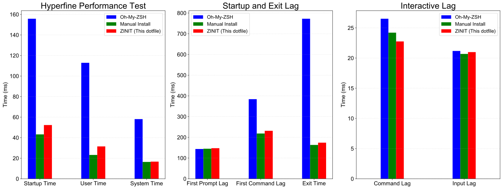

# Dotfiles

現代、快速、方便、功能齊全的 ZSH dotfiles。

參考多份的 dotfiles 完成，截取各個優點並且大量使用 [zsh-defer](https://github.com/romkatv/zsh-defer) 優化載入速度，還能自動安裝套件和 symlink 設定檔，只需在安裝過程中輸入密碼即可完成。對比其他 dotfiles 除了選擇更好、仍持續更新的插件之外，也正確設定自動補全，很多人的自動補全都沒有正確啟用。

## 速度

快不是講講也不是亂測，對比其他文章只簡單使用 `time` 測試，這裡使用全面且嚴謹的 [zsh-bench](https://github.com/romkatv/zsh-bench/) 測試，同時也提供直觀易懂的 hyperfine 進行測試。測試執行於 M1 MacBook Pro，zsh-bench 使用預設值，hyperfine 使用 `hyperfine --runs 100 --warmup 3 'zsh -i -c exit 0'` 測試。

可以看到載入速度大幅領先 Oh-My-ZSH，在某些項目更可以和不使用套件管理器的速度持平甚至超越，而且注意兩個對手都公平的使用 zsh-defer 加速。

<p align="center">
  
</p>

附帶一提，ZINIT 除了比 Oh-My-ZSH 更快管理插件也更方便，不需要自己 clone 插件，也不需要一個額外文件負責設定插件管理器本身。

## Feature

設定基於簡單原則完成，外觀設定模仿 vscode 預設主題，一律使用 nerd font (MesloLGS NF) 字體。

- 📂 集中管理：不需要把安裝腳本和設定檔分開管理，一次完成安裝和設定
- 🛠️ 易於調整：.zshrc 乾淨簡潔，讓你不會每次修改頭都很痛
- 🚀 快速啟動：大量使用 zsh-defer 實現懶加載
- 📚 完整註解：保證你看得懂 zshrc 在寫什麼以及為何這樣寫
- 🔄 輕鬆更新：執行 `update-dotfiles` 就可輕鬆更新所有插件和系統套件
- 🎨 已配置完成的 Powerlevel10k 主題
- 📦 多個預先配置的插件
  - zsh-syntax-highlighting 語法上色
  - zsh-autosuggestions 指令歷史建議
  - zsh-completions 指令補全
  - colored-man-pages 上色的 man pages
  - extract 自動解壓縮
  - z 快速切換目錄
- 🌐 LANG、LC_ALL 和 Git 都已經設定好繁體中文
- ✅ GPG、homebrew 和 Git 等套件的常見問題都已經解決
- 🎯 正確的設定指令補全
- ⚙️ 完善設定的 gitconfig，大量借鑒 [mathiasbynens](https://github.com/mathiasbynens/dotfiles)
- 🖥️ 現代化終端機
  - 使用現代終端機，分割視窗不再需要 tmux 並且設定好外觀主題和鍵盤映射
  - wezterm: [binwenwu/wezterm-config](https://github.com/binwenwu/wezterm-config/)
  - warp: [warpdotdev/themes](https://github.com/warpdotdev/themes)
- ✏️ 文字編輯
  - neovim: 使用 Lazyvim 設定檔，關閉所有 lsp，鍵盤映射 Ctrl+d 為黑洞刪除
  - helix: onedarker 主題，並且整合 ruff lsp
- 🔧 工具
  - gallery-dl: 精心設計的 config.json，只需修改路徑即可使用
  - yt-dlp: 設定檔為最高畫質和音質，開箱即用

## 哪裡不一樣？

本份 dotfiles 由 [holman](https://github.com/holman/dotfiles) 的修改而來，和原版相比：

1. 使用插件管理工具
2. 清理老舊腳本，以現代、現成的工具完成同樣功能
3. 修改資料夾架構，集中管理 symlink 和安裝腳本，更直觀易於維護
4. 簡化系統路徑設定，原版 FPATH 會有很多路徑
5. 優化安裝腳本，簡單易懂而且功能更強

## 安裝

```sh
git clone --depth=1 --recursive --shallow-submodules https://github.com/ZhenShuo2021/dotfiles-macos.git ~/.dotfiles
cd ~/.dotfiles
find . -type f -name "*.sh" -exec chmod +x {} \; 
src/bootstrap.sh
```

## 快捷鍵列表

優化直覺性，盡量同步成系統內建用法。

<details>

<summary>終端機</summary>

**Warp**: 同 WezTerm  
**WezTerm**:  

- `⌘`: SUPER
- `⌘`+`^`: SUPER_REV
- `⌥`: ALT

```lua
if platform.is_mac then
   mod.SUPER = 'SUPER'
   mod.SUPER_REV = 'SUPER|CTRL'
elseif platform.is_win or platform.is_linux then
   mod.SUPER = 'ALT' -- to not conflict with Windows key shortcuts
   mod.SUPER_REV = 'ALT|CTRL'
end
```

- 視窗
  - 垂直分割: `SUPER`+`d`
  - 水平分割: `SUPER`+`D`
  - 切換: `SUPER_REV` + `方向鍵`
- 向上捲動: `CTRL`+`f`
- 向下捲動: `CTRL`+`d`
- 原本的背景圖片放在 backdrops/archive 裡面，移出來就可以有隨機背景圖片。

</details>

<details>

<summary>Neovim</summary>

這其實是一個速查表，大部分都是預設值。

<table>
  <tr>
    <th>按鍵</th>
    <th>說明</th>
  </tr>
  <tr>
    <td><code>a</code>/<code>s</code></td>
    <td>在光標前/後插入</td>
  </tr>
  <tr>
    <td><code>Ctrl+d</code></td>
    <td>黑洞刪除</td>
  </tr>
  <tr>
    <td><code>Ctrl+o</code></td>
    <td>回到上一個位置 (等同 vscode Ctrl+-)</td>
  </tr>
  <tr>
    <td><code>Home</code></td>
    <td>仿照 vscode 的智慧 Home 鍵</td>
  </tr>
  <tr>
    <td><code>*</code></td>
    <td>下一個文字出現位置</td>
  </tr>
  <tr>
    <td><code>g-d</code></td>
    <td>跳到變數定義位置</td>
  </tr>
  <tr>
    <td><code>Ctrl-f</code></td>
    <td>往下捲動10行</td>
  </tr>
  <tr>
    <td><code>Ctrl-b</code></td>
    <td>往上捲動10行</td>
  </tr>
  <tr>
    <td><code>Ctrl-o</code></td>
    <td>回到前一個位置</td>
  </tr>
  <tr>
    <td><code>Space-e</code></td>
    <td>開啟檔案瀏覽器</td>
  </tr>
  <tr>
    <td><code>Ctrl+H/L</code></td>
    <td>切換檔案瀏覽器聚焦位置</td>
  </tr>
  <tr>
    <td><code>Shift+H/L</code></td>
    <td>切換檔案瀏覽器中開啟的檔案</td>
  </tr>
  <tr>
    <td><code>Space-b-d</code></td>
    <td>光標切換檔案/檔案瀏覽器</td>
  </tr>
  <tr>
    <td><code>h</code></td>
    <td>在檔案瀏覽器中回到上一層</td>
  </tr>
</table>

</details>

<details>

<summary>Git</summary>

大量參考 [mathiasbynens](https://github.com/mathiasbynens/dotfiles)，可使用 `git aliases` 查看 git 系統內的 alias，別名來源有三個：

1. [oh-my-zsh](https://github.com/ohmyzsh/ohmyzsh/tree/master/plugins/git)
2. src/bin/ 裡面的會被綁定到 .gitconfig 裡面作為 alias 使用
3. src/zsh/alias.zsh 是最高層級，會覆蓋所有 alias

<table>
  <tr>
    <th>指令</th>
    <th>全名</th>
    <th>用途簡介</th>
  </tr>
  <tr>
    <td>gc</td>
    <td>git commit</td>
    <td>提交變更</td>
  </tr>
  <tr>
    <td>gc!</td>
    <td>git commit --amend --no-verify</td>
    <td>合併上一提交</td>
  </tr>
  <tr>
    <td>gca</td>
    <td>git commit -a</td>
    <td>提交追蹤檔案</td>
  </tr>
  <tr>
    <td>gco</td>
    <td>git checkout</td>
    <td>切換分支</td>
  </tr>
  <tr>
    <td>gcb</td>
    <td>git copy-branch-name</td>
    <td>複製分支名稱</td>
  </tr>
  <tr>
    <td>gcp</td>
    <td>git cherry-pick</td>
    <td>複製提交</td>
  </tr>
  <tr>
    <td>grb</td>
    <td>git rebase</td>
    <td>變基</td>
  </tr>
  <tr>
    <td>grba</td>
    <td>git rebase --abort</td>
    <td>中止變基</td>
  </tr>
  <tr>
    <td>grbc</td>
    <td>git rebase --continue</td>
    <td>繼續變基</td>
  </tr>
  <tr>
    <td>grbi</td>
    <td>git rebase --interactive</td>
    <td>互動式變基</td>
  </tr>
  <tr>
    <td>grbo</td>
    <td>git rebase --onto</td>
    <td>指定基底變基</td>
  </tr>
  <tr>
    <td>grbs</td>
    <td>git rebase --skip</td>
    <td>跳過當前提交</td>
  </tr>
  <tr>
    <td>gb</td>
    <td>git branch</td>
    <td>顯示分支</td>
  </tr>
  <tr>
    <td>gs</td>
    <td>git status -sb</td>
    <td>簡要狀態</td>
  </tr>
  <tr>
    <td>ge</td>
    <td>git-edit-new</td>
    <td>編輯新檔</td>
  </tr>
  <tr>
    <td>gl</td>
    <td>git pull --prune</td>
    <td>拉取更新</td>
  </tr>
  <tr>
    <td>glog</td>
    <td>git log --graph ...</td>
    <td>顯示提交圖</td>
  </tr>
  <tr>
    <td>gloga</td>
    <td>git log --graph ...</td>
    <td>顯示提交樹</td>
  </tr>
  <tr>
    <td>gp</td>
    <td>git push</td>
    <td>推送分支</td>
  </tr>
  <tr>
    <td>gp!</td>
    <td>git push --force-with-lease --force-if-includes</td>
    <td>強制推送</td>
  </tr>
  <tr>
    <td>gd</td>
    <td>git diff --color | sed ...</td>
    <td>顯示差異</td>
  </tr>
</table>

</details>

<details>

<summary>系統</summary>

<table>
  <tr>
    <th>指令</th>
    <th>全名</th>
    <th>用途簡介</th>
  </tr>
  <tr>
    <td>vv</td>
    <td>nvim</td>
    <td>啟動 Neovim Editor</td>
  </tr>
  <tr>
    <td>hnc</td>
    <td>hugo new content</td>
    <td>新增 Hugo 內容文章</td>
  </tr>
  <tr>
    <td>l</td>
    <td>ls -lAGh</td>
    <td>詳細列出檔案</td>
  </tr>
  <tr>
    <td>ll</td>
    <td>ls -FG</td>
    <td>普通列出檔案</td>
  </tr>
  <tr>
    <td>lll</td>
    <td>ls -lA</td>
    <td>機器可讀列出</td>
  </tr>
  <tr>
    <td>reload!</td>
    <td>. ~/.zshrc</td>
    <td>重新載入 Zsh</td>
  </tr>
  <tr>
    <td><code>..</code> <code>cd..</code></td>
    <td>cd ..</td>
    <td>回上一層</td>
  </tr>
  <tr>
    <td><code>...</code> <code>cd...</code></td>
    <td>cd ../..</td>
    <td>回兩層</td>
  </tr>
  <tr>
    <td><code>....</code> <code>cd....</code></td>
    <td>cd ../../..</td>
    <td>回三層</td>
  </tr>
  <tr>
    <td>pubkey</td>
    <td>more ~/.ssh/id_rsa.pub | pbcopy</td>
    <td>複製公鑰</td>
  </tr>
  <tr>
    <td>docker-compose</td>
    <td>例如 dco=docker-compose</td>
    <td><a href="https://github.com/ohmyzsh/ohmyzsh/tree/master/plugins/docker-compose" target="_blank">使用插件</a></td>
  </tr>
</table>

</details>

## 架構說明

大幅簡化簡化架構，src 只有以下幾個資料夾：

- **bin/**: 所有在 bin 資料夾的指令都會被載入並隨處可用
- **fpath/**: 此資料夾會加入 FPATH，這個路徑多用於指令補全
- **installer/\*.sh**: main 作為入口在 bootstrap 時被呼叫，執行所有 `*.sh` 檔
- **symlink/**: 這裡的所有檔案都會被 symlinked 到 `$HOME` 以集中管理設定檔
- **zsh/\*.zsh**: zsh 資料夾中的所有 `*.zsh` 檔都會被載入到 `.zshrc` 的文件，`load_all.zsh` 是主入口

所有 submodule 都在 custom 分支進行修改。每個分支的插件路徑略有不同，尊重插件管理器避免自創路徑。

## Brewfile 套件說明

簡單介紹都裝了哪些東西，只講大件的，基本上都是開源工具

### 開發者

1. docker/docker-compose: 容器
2. iterm2/wezterm/warp/tmux: 終端機工具
3. helix/neovim/Lazyvim: 文字編輯器和擴展
4. fd/fzf/ripgrep: Lazyvim 推薦的搜尋工具
5. git/gh/act: git/本地 github cli/actions平台

### 終端工具

1. exiftool: 相片元資料編輯器
2. imagemagick: 相片編輯工具
3. gallery-dl/yt-dlp/motrix: 圖片/影片/萬用下載工具
4. bat: 更好用的 cat
5. yazi: 檔案檢視器
6. hiddenbar: 狀態欄隱藏工具
7. ffmpeg: 影片轉檔

### 其他工具

1. Localsend: 跨裝置類 airdrop
2. upscayl: AI 圖片超解析度工具
3. Spotify
4. chrome
5. joplin
6. google-drive
7. teamviewer
8. raycast
9. stats

# Todo

- [x] [不需重複輸入密碼](https://github.com/alrra/dotfiles/blob/main/src/os/utils.sh)
- [ ] [免 Git 安裝](https://github.com/alrra/dotfiles?tab=readme-ov-file#setup)
- [ ] [支援 Ubuntu](https://github.com/alrra/dotfiles)

# Acknowledgments

This software is built upon resources from Holman's dotfiles (MIT License, https://github.com/holman), LazyVim starter template (Apache-2.0 License, https://github.com/LazyVim/starter), KevinSilvester's wezterm-config (MIT License, https://github.com/KevinSilvester/wezterm-config), and Warp themes (Apache License 2.0, https://github.com/warpdotdev/themes).
