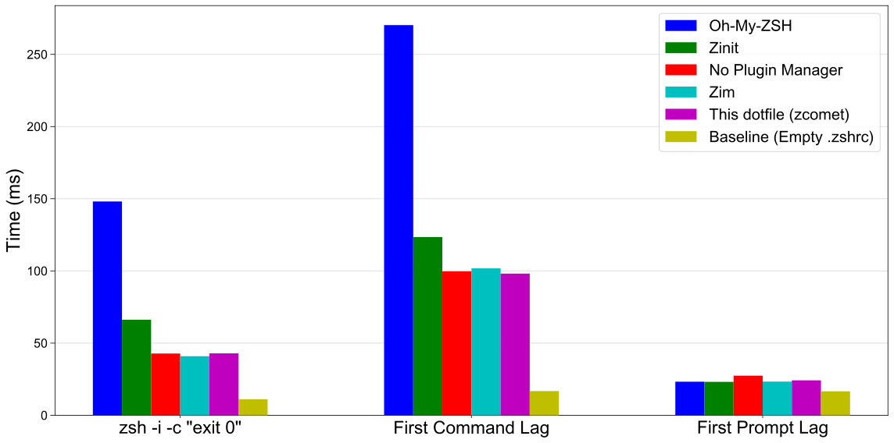

<h1 align="center">My Zsh Dotfile Built for Speed!</h1>

</br>

<p align="center">
  
</p>

## How Fast Is It

使用專門測試 shell 的 [zsh-bench](https://github.com/romkatv/zsh-bench/) 進行測試[^test-method]，測試項目涵蓋五種框架：

- Oh-My-ZSH: 最多人使用的框架
- Zinit: 內建豐富延遲載入功能的插件管理器
- No Plugin Manager: 不使用插件管理器以減少延遲
- Zim: 標榜 [blazing speed](https://github.com/zimfw/zimfw/wiki/Speed) 的插件管理器
- zcomet: 此份 dotfile
- Baseline: 基準線，移除 .zshrc，本機能達到的最快速度

所有框架都公平的使用 zsh-defer 加速，測試項目的選擇從最廣泛使用的框架到手動優化，以便準確定位效能，可以看到比 Zinit 更快，基本上追平甚至超越不使用插件管理器的速度，同時又比 Zim 易於設定。

<p align="center">
  
</p>

[^test-method]: 測試執行於 M1 MacBook Pro 8G RAM，zsh-bench 使用預設值，測試總共載入的插件有 powerlevel10k, zsh-defer, zsh-syntax-highlighting, zsh-autosuggestions, zsh-completions, zsh-z, zsh-history-substring-search, extract, git。

## Feature

不只快而且功能齊全。

- 🚀 0.03s 的首次命令延遲
- 📂 集中管理安裝腳本和設定檔
- 📚 完整註解
- 🛠️ 易於調整
- 🔲 極簡風格：沒有花花綠綠的分散注意力
- 🎨 WezTerm 主題
- ✏️ neovim 設定檔
- ✅ zsh-syntax-highlighting 語法上色
- ✅ zsh-autosuggestions 指令歷史建議
- ✅ zsh-completions 指令補全
- ✅ zsh-z 快速切換目錄
- ✅ colored-man-pages
- ✅ GPG、homebrew 和 Git 等套件的常見問題都已經解決
- ✅ 指令補全

## 安裝

```shell
ASK=1 sh -c "$(curl -fsSL https://raw.githubusercontent.com/ZhenShuo2021/dotfiles/main/remote_install.sh) -k -v"
```

首次執行不會完整安裝，因為 GPG 等需要進一步設定，移除 `ASK=1` 會使用預設名稱作為電腦和用戶名，再次執行 `chezmoi -k apply` 可以進行後續部分的安裝。

其他常用的 chezmoi 指令為請查看 Makefile。

## 最簡安裝

最簡安裝只會複製 Shell 設定不會安裝額外工具。

```sh
MINIMUM=1 sh -c "$(curl -fsSL https://raw.githubusercontent.com/ZhenShuo2021/dotfiles/main/remote_install.sh) -k -v"
```

如果使用 Git Bash 安裝完成後還要手動完成以下步驟：

```sh
# 開啟 Git Bash

# 設定檔捷徑
ln -s ~/.config/zsh/zshrc ~/.zshrc
ln -s ~/.config/zsh/zshenv ~/.zshenv

# 預設使用 Zsh
$ echo "if [ -t 1 ]; then exec zsh; fi" > ~/.bashrc

# 移動 Git 設定位置
mkdir -p ~/.config/git
mv ~/.gitconfig ~/.config/git/gitconfig
mv ~/.gitignore_global ~/.config/git/gitignore_global

# 啟用 Zsh 完成後續插件安裝
exec zsh
```

## 修改

zshrc 相關設定在 `~/.local/share/chezmoi/home/private_dot_config/zsh` 中，由以下組成

1. 00-basic.zsh: 基礎路徑設定，指向 Zsh 設定檔和 chezmoi 裡面的設定檔
2. 01-plugins.zsh: 載入插件
3. 02-preference.zsh: 各種路徑和常數設定
4. 03-system.zsh: 設定 `setopt` 和 `bindkey`
5. 04-completion.zsh: 設定自動補全
6. 05-misc.zsh: 其餘雜項，如 zsh-hook
7. 99-alias.zsh: 設定別名，可以任意修改
8. 100-p10k.zsh: p10k 設定檔

我的工作流程是使用 `c [tab]` 跳轉到 chezmoi 目錄，`cn` 開啟 VSCode，最後使用 `make apply` 應用到主目錄。

## Profiling

內建函式可以方便的進行效能分析，有兩個指令：

1. `zsh_prof_zprof` 使用 `zprof` 指令進行分析，提供數字參數以設定顯示行數，數字以外的參數顯示所有結果。
2. `zsh_prof_xtrace` 藉由 `XTRACE` 和 `EPOCHREALTIME` 生成更細節的報告，使用 `zsh_prof_xtrace -h` 查看使用方式。

<p align="center">

</p>

## 快捷鍵列表

優化直覺性，盡量同步成系統內建用法。

<details>

<summary>終端機</summary>

**Warp**: 同 WezTerm
**WezTerm**:

- `⌘`: SUPER
- `⌘`+`^`: SUPER_REV
- `⌥`: ALT

```lua
if platform.is_mac then
   mod.SUPER = 'SUPER'
   mod.SUPER_REV = 'SUPER|CTRL'
elseif platform.is_win or platform.is_linux then
   mod.SUPER = 'ALT' -- to not conflict with Windows key shortcuts
   mod.SUPER_REV = 'ALT|CTRL'
end
```

- 視窗
  - 垂直分割: `SUPER`+`d`
  - 水平分割: `SUPER`+`D`
  - 切換: `SUPER_REV` + `方向鍵`
- 原本的背景圖片放在 backdrops/archive 裡面，移出來就可以有隨機背景圖片。

</details>

<details>

<summary>Neovim</summary>

這其實是一個速查表，大部分都是預設值。

<table>
  <tr>
    <th>按鍵</th>
    <th>說明</th>
  </tr>
  <tr>
    <td><code>a</code>/<code>s</code></td>
    <td>在光標前/後插入</td>
  </tr>
  <tr>
    <td><code>Ctrl+d</code></td>
    <td>黑洞刪除</td>
  </tr>
  <tr>
    <td><code>Ctrl+o</code></td>
    <td>回到上一個位置 (等同 vscode Ctrl+-)</td>
  </tr>
  <tr>
    <td><code>Home</code></td>
    <td>仿照 vscode 的智慧 Home 鍵</td>
  </tr>
  <tr>
    <td><code>*</code></td>
    <td>下一個文字出現位置</td>
  </tr>
  <tr>
    <td><code>g-d</code></td>
    <td>跳到變數定義位置</td>
  </tr>
  <tr>
    <td><code>Ctrl-f</code></td>
    <td>往下捲動10行</td>
  </tr>
  <tr>
    <td><code>Ctrl-b</code></td>
    <td>往上捲動10行</td>
  </tr>
  <tr>
    <td><code>Ctrl-o</code></td>
    <td>回到前一個位置</td>
  </tr>
  <tr>
    <td><code>Space-e</code></td>
    <td>開啟檔案瀏覽器</td>
  </tr>
  <tr>
    <td><code>Ctrl+H/L</code></td>
    <td>切換檔案瀏覽器聚焦位置</td>
  </tr>
  <tr>
    <td><code>Shift+H/L</code></td>
    <td>切換檔案瀏覽器中開啟的檔案</td>
  </tr>
  <tr>
    <td><code>Space-b-d</code></td>
    <td>光標切換檔案/檔案瀏覽器</td>
  </tr>
  <tr>
    <td><code>h</code></td>
    <td>在檔案瀏覽器中回到上一層</td>
  </tr>
</table>

</details>

<details>

<summary>Git</summary>

大量參考 [mathiasbynens](https://github.com/mathiasbynens/dotfiles)，可使用 `git aliases` 查看 git 系統內的 alias，別名來源有三個：

1. [oh-my-zsh](https://github.com/ohmyzsh/ohmyzsh/tree/master/plugins/git)
2. src/bin/ 裡面的會被綁定到 .gitconfig 裡面作為 alias 使用
3. src/zsh/alias.zsh 是最高層級，會覆蓋所有 alias

<table>
  <tr>
    <th>指令</th>
    <th>全名</th>
    <th>用途簡介</th>
  </tr>
  <tr>
    <td>gc</td>
    <td>git commit</td>
    <td>提交變更</td>
  </tr>
  <tr>
    <td>gc!</td>
    <td>git commit --amend --no-verify</td>
    <td>合併上一提交</td>
  </tr>
  <tr>
    <td>gca</td>
    <td>git commit -a</td>
    <td>提交追蹤檔案</td>
  </tr>
  <tr>
    <td>gco</td>
    <td>git checkout</td>
    <td>切換分支</td>
  </tr>
  <tr>
    <td>gcb</td>
    <td>git copy-branch-name</td>
    <td>複製分支名稱</td>
  </tr>
  <tr>
    <td>gcp</td>
    <td>git cherry-pick</td>
    <td>複製提交</td>
  </tr>
  <tr>
    <td>gtlll</td>
    <td>gtlll(){ git tag --sort=-v:refname -n999 --format="[%(objectname:short) %(refname:short)] %(contents:lines=999)%0a" --list "${1}*" }; noglob gtlll</td>
    <td>尋找指定標籤，無輸入就列出所有，類似指令有 gtll/gtl</td>
  </tr>
  <tr>
    <td>grb</td>
    <td>git rebase</td>
    <td>變基</td>
  </tr>
  <tr>
    <td>grba</td>
    <td>git rebase --abort</td>
    <td>中止變基</td>
  </tr>
  <tr>
    <td>grbc</td>
    <td>git rebase --continue</td>
    <td>繼續變基</td>
  </tr>
  <tr>
    <td>grbi</td>
    <td>git rebase --interactive</td>
    <td>互動式變基</td>
  </tr>
  <tr>
    <td>grbo</td>
    <td>git rebase --onto</td>
    <td>指定基底變基</td>
  </tr>
  <tr>
    <td>grbs</td>
    <td>git rebase --skip</td>
    <td>跳過當前提交</td>
  </tr>
  <tr>
    <td>gb</td>
    <td>git branch</td>
    <td>顯示分支</td>
  </tr>
  <tr>
    <td>gs</td>
    <td>git status -sb</td>
    <td>簡要狀態</td>
  </tr>
  <tr>
    <td>ge</td>
    <td>git-edit-new</td>
    <td>編輯新檔</td>
  </tr>
  <tr>
    <td>gl</td>
    <td>git pull --prune</td>
    <td>拉取更新</td>
  </tr>
  <tr>
    <td>glog</td>
    <td>git log --graph ...</td>
    <td>顯示提交圖</td>
  </tr>
  <tr>
    <td>gloga</td>
    <td>git log --graph ...</td>
    <td>顯示提交樹</td>
  </tr>
  <tr>
    <td>gp</td>
    <td>git push</td>
    <td>推送分支</td>
  </tr>
  <tr>
    <td>gp!</td>
    <td>git push --force-with-lease --force-if-includes</td>
    <td>強制推送</td>
  </tr>
  <tr>
    <td>gd</td>
    <td>git diff --color | sed ...</td>
    <td>顯示差異</td>
  </tr>
</table>

</details>

<details>

<summary>系統</summary>

<table>
  <tr>
    <th>指令</th>
    <th>全名</th>
    <th>用途簡介</th>
  </tr>
  <tr>
    <td>v</td>
    <td>nvim</td>
    <td>啟動 Neovim Editor</td>
  </tr>
  <tr>
    <td>c</td>
    <td>N/A</td>
    <td>自訂的函式可設定目錄快速跳轉</td>
  </tr>
  <tr>
    <td>cn</td>
    <td>code -n .</td>
    <td>以編輯器開啟目前目錄，和 c 合併使用非常方便</td>
  </tr>
  <tr>
    <td>e</td>
    <td>exit 0</td>
    <td>退出終端</td>
  </tr>
  <tr>
    <td>switch_en</td>
    <td>export LC_ALL='en_US.UTF-8'; export LANG='en_US.UTF-8'</td>
    <td>暫時切換到英語系統</td>
  </tr>
  <tr>
    <td>switch_twn</td>
    <td>export LC_ALL='zh_TW.UTF-8'; export LANG='zh_TW.UTF-8'</td>
    <td>暫時切換到中文系統</td>
  </tr>
  <tr>
    <td>gpg_test</td>
    <td>echo test | gpg --clear-sign</td>
    <td>測試 GPG 是否能正確簽署</td>
  </tr>
  <tr>
    <td>gpg_reload</td>
    <td>gpgconf --kill gpg-agent; gpgconf --reload gpg-agent</td>
    <td>重新載入 GPG</td>
  </tr>
  <tr>
    <td>gpg_[tab]</td>
    <td>顯示所有 gpg alias</td>
    <td>更多常用的 alias 都已經內建不浪費篇幅</td>
  </tr>
  <tr>
    <td>hnc</td>
    <td>hugo new content</td>
    <td>新增 Hugo 內容文章</td>
  </tr>
  <tr>
    <td>ls</td>
    <td>ls --color=auto --group-directories-first</td>
    <td>列出檔案</td>
  </tr>
  <tr>
    <td>l</td>
    <td>ls</td>
    <td>ls 的縮寫</td>
  </tr>
  <tr>
    <td>ll</td>
    <td>ls --color=auto -A --group-directories-first</td>
    <td>列出隱藏檔案</td>
  </tr>
  <tr>
    <td>l3</td>
    <td>ls --color=auto -lAh --time-style=+'' --group-directories-first</td>
    <td>列出檔案屬性但是不顯示時間和隱藏檔案</td>
  </tr>
  </tr>
  <tr>
    <td>l4</td>
    <td>ls --color=auto -lahF --time-style='+[%Y-%m-%d %H:%M:%S]' --group-directories-first</td>
    <td>列出檔案所有檔案屬性</td>
  </tr>
  <tr>
    <td>reload!</td>
    <td>. ~/.zshrc</td>
    <td>重新載入 Zsh</td>
  </tr>
  <tr>
    <td><code>..</code> <code>cd..</code></td>
    <td>cd ..</td>
    <td>回上一層</td>
  </tr>
  <tr>
    <td><code>...</code> <code>cd...</code></td>
    <td>cd ../..</td>
    <td>回兩層</td>
  </tr>
  <tr>
    <td><code>....</code> <code>cd....</code></td>
    <td>cd ../../..</td>
    <td>回三層</td>
  </tr>
  <tr>
    <td>pubkey</td>
    <td>more ~/.ssh/id_rsa.pub | pbcopy</td>
    <td>複製公鑰</td>
  </tr>
  <tr>
    <td>docker-compose</td>
    <td>例如 dco=docker-compose</td>
    <td><a href="https://github.com/ohmyzsh/ohmyzsh/tree/master/plugins/docker-compose" target="_blank">使用插件</a></td>
  </tr>
</table>

</details>

# FAQ

- 補全設定  
Zsh 本身的補全系統很麻煩，大量使用 zsh-defer 又讓偵錯更麻煩，偵錯時建議暫時移除所有 zsh-defer 才會顯示錯誤訊息。使用 `echo _comps[your_function]` 檢查是否印出函式才表示正確啟用，Zsh 補全系統的載入順序為
  1. 設定 fpath
  2. 設定 zstyle
  3. 執行 compinit
  4. 執行 functions requires compdef
  5. 執行 zsh-syntax-highlighting > zsh-autosuggestions  
這幾項設定加上 `eval $(/opt/homebrew/bin/brew shellenv)` 是影響補全是否成功啟用的關鍵節點，試著把補全設定放在這些指令前後進行測試，或者是手動載入 `autoload -Uz /path/to/_completion-file` 補全檔案。  

- 遇到奇怪的問題  
通常原因是延遲載入 brew，如果不想處理就改為不使用 zsh-defer 載入補全系統，方式是將補全系統初始化 compinit 移動到 plugin.zsh 中，並且把 eval brew shellenv 移動到 .zprofile，最後移除 preference.zsh 的 brew PATH。

- 為何使用 zcomet?  
語法簡單而且支援直接載入 url，比起 Zinit 更輕量快速，就算遇到問題直接切換到 Zinit 也非常容易。

- 為何不用 Zim?  
Zim 需要管理額外的 .zimrc 文件，也不支援直接載入 url，最重要的是難以獨立設定哪些插件需要使用 zsh-defer，如果不使用延遲加載，所有插件管理器都差不多慢。

- 為何不用 Zinit?  
語法過於複雜，本體載入速度也太慢，請見 [zsh-plugin-manager-benchmark](https://github.com/rossmacarthur/zsh-plugin-manager-benchmark)。

- 為何不用 zsh4humans?  
z4h [是最快的插件管理器](https://github.com/zimfw/zimfw/wiki/Speed)，但是我不想要一個強迫使用 p10k、設定混亂、會覆蓋我 zshrc 的插件管理器，如果沒有這些問題他會是完美的。

- 為何不用 antidote?  
有太多 anti* 的插件管理器了，我不知道他會不會又停止開發，而且正好在換代到 V2。

- 如何更快?  
現在的效能瓶頸在主題和插件管理器本身的載入，現在的啟動速度已經足夠快沒有進一步優化的必要，兩個優化方法是主題改用 [pure](https://github.com/sindresorhus/pure)，並且移除插件管理器[手動管理插件](https://github.com/romkatv/zsh-bench/blob/661fc46c74fd970f00346d285f5ae434130491f0/configs/diy%2B%2B/skel/.zshrc)（如果你不使用 diy++ 的方式設定，速度會比使用插件管理器還慢）。

- 我想從根本加速  
現在就幾乎是最快的設定，不可能更快了，直接改用 fish shell 才能從根本解決問題。

- 繪製自己的測試結果：將數據更新在 .github/benchmark.py 後使用 `uv run .github/benchmark.py` 可以直接執行不需建立虛擬環境。

# Acknowledgments

- Code is based on [narze's dotfile (MIT License)](https://github.com/narze/dotfiles)
- Snippets from [Holman's dotfile (MIT License)](https://github.com/holman/dotfiles), [mathiasbynens (MIT License)](https://github.com/mathiasbynens/dotfiles)
- The idea of modularization comes from [xero's dotfile](https://github.com/xero/dotfiles/tree/main/zsh/.config/zsh)
